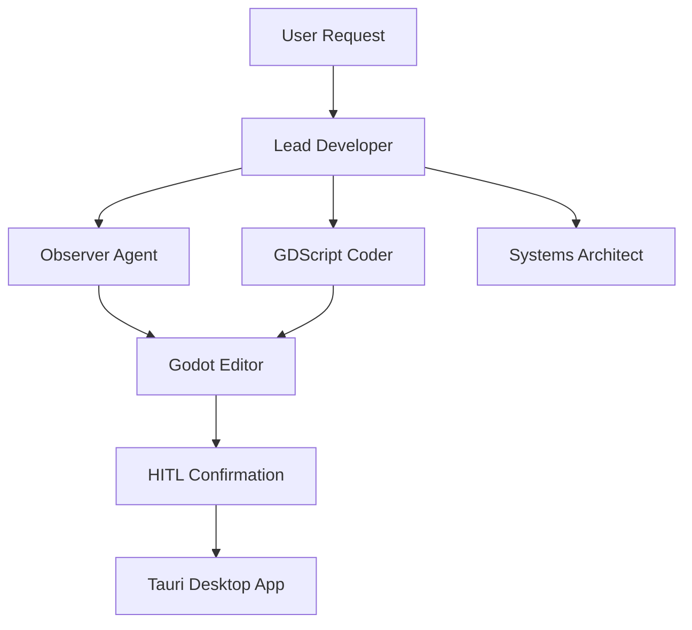

# Godoty Agent Development Guidelines

This document follows [Better Agents](https://github.com/langwatch/better-agents) standards for building production-ready AI agents.

## Architecture Overview

Godoty uses a multi-agent team architecture built on the [Agno](https://agno.com) framework. The team operates in "coordinate" mode where the Lead Developer orchestrates specialized agents.



## Agent Team

### Lead Developer
- **Role**: Team Coordinator
- **Tools**: `get_scene_tree`, `get_open_script`, `read_project_file`
- **Purpose**: Entry point for all user requests. Gathers initial context and delegates to specialized agents.

### Observer
- **Role**: Perception Specialist  
- **Tools**: `request_screenshot`, `get_scene_tree`, `get_open_script`, `get_project_settings`
- **Purpose**: Gathers visual and state context from the Godot Editor.

### GDScript Coder
- **Role**: Code Implementation Specialist
- **Tools**: `read_project_file`, `write_project_file`, `create_node`, `delete_node`, `set_project_setting`
- **Purpose**: Writes and modifies GDScript code with Godot 4.x best practices.

### Systems Architect
- **Role**: Planning and Design Specialist
- **Tools**: `read_project_file`, `get_scene_tree`
- **Purpose**: Plans and decomposes complex multi-step features.

## Tool Categories

### Perception Tools (Read-only)
| Tool | Description | Returns |
|------|-------------|---------|
| `request_screenshot` | Capture viewport image | Base64 JPEG |
| `get_scene_tree` | Get scene node hierarchy | Structured tree dict |
| `get_open_script` | Get current script content | Path + content dict |
| `get_project_settings` | Get project configuration | Settings dict |

### Actuation Tools (Require HITL)
| Tool | Description | HITL Required |
|------|-------------|---------------|
| `read_project_file` | Read file content | No |
| `write_project_file` | Write/create file | **Yes** |
| `create_node` | Add node to scene | **Yes** |
| `delete_node` | Remove node from scene | **Yes** |
| `set_project_setting` | Modify project.godot | **Yes** |

## HITL (Human-in-the-Loop) Flow

All destructive operations require user confirmation via the Tauri desktop app:

1. Agent requests action via tool call
2. Tool sends confirmation request to ConnectionManager → Tauri UI
3. User approves/denies in desktop app
4. If approved, command sent to Godot plugin for execution
5. Result returned to agent

## Development Guidelines

### Adding New Tools

1. Define the tool function in `brain/app/agents/tools.py`
2. Use `async def` for all tools that communicate with Godot
3. Add HITL confirmation for destructive operations:
   ```python
   approved = await _request_hitl_confirmation(
       action_type="your_action",
       description="Human-readable description",
       details={"key": "value"},
   )
   if not approved:
       return {"success": False, "message": "Operation denied by user"}
   ```
4. Export in `__all__` list
5. Import and assign to appropriate agent(s) in `team.py`

### Adding New Agents

1. Create prompt file in `prompts/{agent_name}.yaml`
2. Add `create_{agent_name}_agent()` function in `team.py`
3. Include appropriate tools based on role
4. Add to team members list in `create_godoty_team()`
5. Update team instructions to include delegation rules

### Prompt Versioning

Prompts are stored in `prompts/` as YAML files with version numbers:

```yaml
name: agent_name
version: 0.0.1
system: |
  Your prompt content here...
```

Increment version when making changes for team collaboration tracking.

## Testing

### Location
- Scenario tests: `tests/scenarios/`
- Integration tests: `tests/`
- Evaluations: `tests/evaluations/` (if added)

### Running Tests
```bash
# All tests
pytest tests/ -v

# Specific scenario
pytest tests/scenarios/test_protocol.py -v
```

## Performance Configuration

Each agent is configured with Agno performance features:

| Parameter | Purpose | Typical Value |
|-----------|---------|---------------|
| `role` | Team coordination identifier | Role description |
| `expected_output` | Guides response format | Output structure |
| `markdown` | Enable markdown formatting | `True` |
| `retries` | API failure retry count | `2` |
| `tool_call_limit` | Prevent runaway execution | `5-10` |

## Resources

- [Agno Documentation](https://docs.agno.com)
- [Better Agents Standards](https://github.com/langwatch/better-agents)
- [Godot 4.x GDScript Guide](https://docs.godotengine.org/en/stable/tutorials/scripting/gdscript/)
