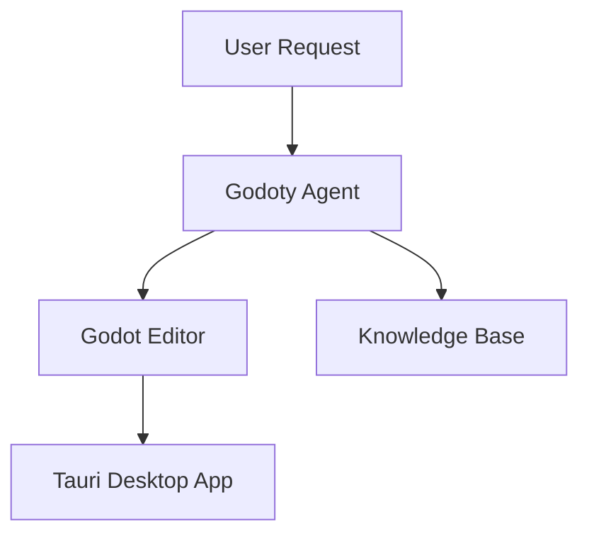

# Godoty Agent Development Guidelines

This document follows [Better Agents](https://github.com/langwatch/better-agents) standards for building production-ready AI agents.

## Architecture Overview

Godoty uses a **unified single-agent architecture** built on the [Agno](https://agno.com) framework. This design follows Anthropic's guidance that "the most successful implementations use simple, composable patterns rather than complex frameworks."



### Why Single Agent?

The previous multi-agent team (Lead, Observer, Coder, Architect) was replaced with a unified agent for:

- **~80% token reduction** - 1 system prompt vs 4
- **No coordination overhead** - No delegation latency or context switching
- **Simpler streaming** - Direct event handling without team routing
- **Easier debugging** - Single agent state to inspect

## Godoty Agent

The unified agent handles all Godot development tasks:

- **Code Writing**: GDScript implementation with Godot 4.x best practices
- **Planning**: Feature decomposition and architecture design
- **Observation**: Scene tree analysis, script inspection, screenshot review
- **Debugging**: Error analysis and fix proposals

### Configuration

```python
from app.agents import create_godoty_agent, GodotySession

# Create agent
agent = create_godoty_agent(
    session_id="session-123",
    jwt_token="sk-...",
    model_id="gpt-4o",
    db=get_db(),
)

# Or use GodotySession for streaming
session = GodotySession(session_id="session-123", jwt_token="sk-...")
async for chunk in session.process_message_stream("Add player movement"):
    print(chunk)
```

### Agent Parameters

| Parameter | Value | Purpose |
|-----------|-------|---------|
| `reasoning` | `True` | Enable chain-of-thought |
| `reasoning_min_steps` | `2` | Minimum thinking steps |
| `reasoning_max_steps` | `5` | Maximum thinking steps |
| `tool_call_limit` | `15` | Prevent runaway execution |
| `retries` | `2` | Automatic retry on failure |
| `markdown` | `True` | Format responses as markdown |

## Knowledge Base

### GodotKnowledge

Semantic search over official Godot documentation:

| Source | Content |
|--------|---------|
| Class Reference | Official Godot node/resource documentation |
| GDScript Reference | Language features (@GDScript, @GlobalScope, primitives) |

```python
from app.knowledge import get_godot_knowledge

knowledge = get_godot_knowledge(version="4.3")
await knowledge.load()

# Search documentation
results = await knowledge.search("CharacterBody2D movement")
```

## Tool Categories

### Perception Tools (Read-only)
| Tool | Description | Returns |
|------|-------------|---------|
| `request_screenshot` | Capture viewport image | Base64 JPEG |
| `get_scene_tree` | Get scene node hierarchy | Structured tree dict |
| `get_open_script` | Get current script content | Path + content dict |
| `get_project_settings` | Get project configuration | Settings dict |
| `get_project_context` | Get project overview | Files, structure, recent errors |

### File Operations
| Tool | Description |
|------|-------------|
| `read_file` | Read file content |
| `write_file` | Write/create file |
| `delete_file` | Delete file |
| `rename_file` | Rename file |
| `move_file` | Move file |
| `copy_file` | Copy file |
| `create_directory` | Create directory |
| `file_exists` | Check file existence |

### File Discovery
| Tool | Description |
|------|-------------|
| `find_files` | Find files by pattern (glob) |
| `search_project_files` | Search file contents |
| `list_project_files` | List project directory |

### Knowledge Tools
| Tool | Description |
|------|-------------|
| `query_godot_docs` | Search Godot documentation |

## Development Guidelines

### Adding New Tools

1. Define the tool function in `brain/app/agents/tools.py`
2. Use `async def` for all tools that communicate with Godot
3. Export in `__all__` list
4. Add to the tools list in `create_godoty_agent()` in `agent.py`

### Modifying the Agent

1. Edit the prompt in `prompts/godoty.yaml`
2. For tool changes, update `brain/app/agents/agent.py`
3. Dynamic context is injected via placeholders:
   - `{{RECENT_ERRORS}}` - Recent console errors
   - `{{ACTIVE_SPEC}}` - Content of `.godoty/spec.md` if exists

### Prompt Structure

The unified prompt is stored in `prompts/godoty.yaml`:

```yaml
name: godoty
version: 1.0.0
meta:
  role: "Godot Development Assistant"
  expertise: ["GDScript", "Godot 4.x", "Game Development"]

system: |
  # Identity
  You are Godoty, an AI assistant for Godot 4.x game development...

  # Capabilities
  - Observe: screenshot, scene tree, scripts
  - Code: read, write, modify GDScript files
  - Plan: decompose features, architect systems
  - Debug: analyze errors, propose fixes

  # GDScript Standards
  - Static typing required
  - Godot 4.x syntax only
  ...
```

## Testing

### Location
- Scenario tests: `tests/scenarios/`
- Integration tests: `tests/`
- Evaluations: `tests/evaluations/`

### Scenario Tests

```python
@pytest.mark.scenario
async def test_player_movement_generation(agent, mock_tools):
    response = await agent.run("Create 2D player movement")
    assert_gdscript_quality(response.content, checks=[
        "static_typing",
        "godot4_syntax",
        "proper_annotations",
    ])
```

### Running Tests
```bash
# All tests
pytest tests/ -v

# Scenario tests only
pytest tests/scenarios/ -v -m scenario

# Code quality evaluation
python -m tests.evaluations.code_quality_eval --model gpt-4o
```

## Project Structure

```
brain/
├── app/
│   ├── agents/
│   │   ├── __init__.py      # Package exports
│   │   ├── agent.py         # Unified Godoty agent
│   │   ├── context.py       # Context caching
│   │   ├── schemas.py       # Pydantic output schemas
│   │   └── tools.py         # Agent tools
│   └── knowledge/
│       ├── __init__.py      # Package exports
│       ├── godot_knowledge.py     # Knowledge base
│       ├── godot_docs_loader.py   # XML doc parser
│       ├── project_knowledge.py   # Project file indexing
│       └── lsp_client.py          # GDScript LSP client
├── tests/
│   ├── scenarios/           # Better Agents scenario tests
│   └── evaluations/         # LLM-as-judge evaluations
└── prompts/
    └── godoty.yaml          # Unified agent prompt
```

## Resources

- [Agno Documentation](https://docs.agno.com)
- [Better Agents Standards](https://github.com/langwatch/better-agents)
- [Godot 4.x GDScript Guide](https://docs.godotengine.org/en/stable/tutorials/scripting/gdscript/)
- [Anthropic: Building Effective Agents](https://www.anthropic.com/research/building-effective-agents)
