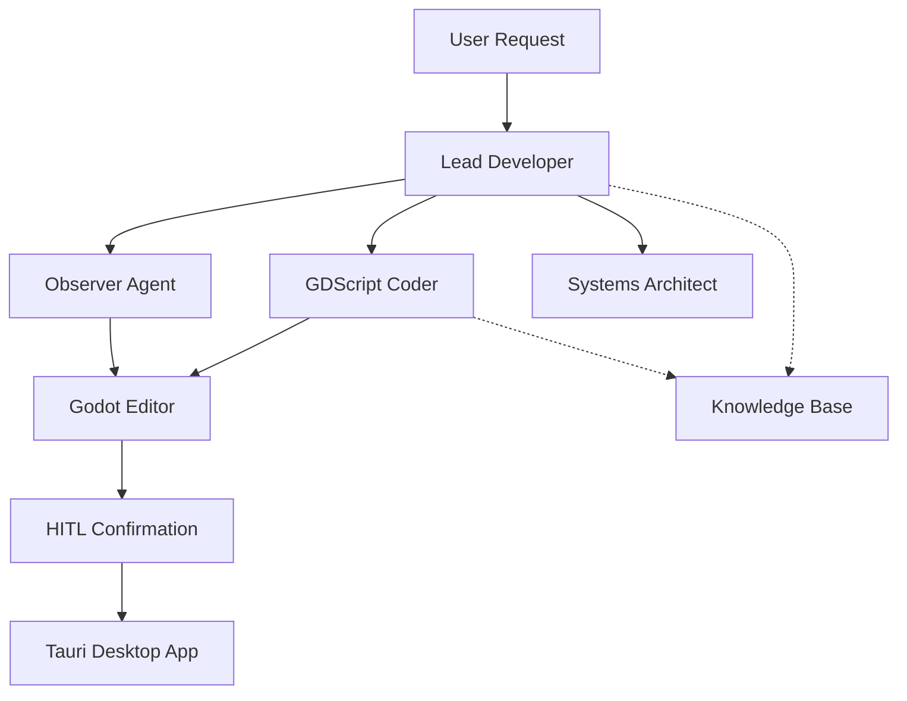

# Godoty Agent Development Guidelines

This document follows [Better Agents](https://github.com/langwatch/better-agents) standards for building production-ready AI agents.

## Architecture Overview

Godoty uses a multi-agent team architecture built on the [Agno](https://agno.com) framework. The team operates in "coordinate" mode where the Lead Developer orchestrates specialized agents.



## Agent Team

### Lead Developer
- **Role**: Team Coordinator
- **Tools**: `ReasoningTools`, `get_scene_tree`, `get_open_script`, `read_project_file`, `get_project_context`
- **Features**: ReasoningTools for think/analyze, user memory, session history
- **Purpose**: Entry point for all user requests. Gathers initial context and delegates to specialized agents.

### Observer
- **Role**: Perception Specialist  
- **Tools**: `request_screenshot`, `get_scene_tree`, `get_open_script`, `get_project_settings`
- **Features**: Reasoning mode for analysis
- **Purpose**: Gathers visual and state context from the Godot Editor.

### GDScript Coder
- **Role**: Code Implementation Specialist
- **Tools**: `read_project_file`, `write_project_file`, `create_node`, `delete_node`, `set_project_setting`, `query_godot_docs`, `get_symbol_info`, `get_code_completions`
- **Features**: Optional structured output (`CodeProposal` schema), tool result compression
- **Purpose**: Writes and modifies GDScript code with Godot 4.x best practices.

### Systems Architect
- **Role**: Planning and Design Specialist
- **Tools**: `read_project_file`, `get_scene_tree`, `list_project_files`, `query_godot_docs`, `get_project_context`
- **Features**: Optional structured output (`ArchitecturePlan` schema), strong reasoning mode
- **Purpose**: Plans and decomposes complex multi-step features.

## Knowledge Base

### EnhancedGodotKnowledge
Multi-source knowledge system with hybrid search (semantic + keyword):

| Source | Content |
|--------|---------|
| Class Reference | Official Godot node/resource documentation |
| GDScript Reference | Language features (@GDScript, @GlobalScope, primitives) |
| Community Tutorials | Best practices, style guides, patterns |

```python
from app.knowledge import get_enhanced_godot_knowledge, create_godot_knowledge_tools

# Get knowledge base
knowledge = get_enhanced_godot_knowledge(version="4.3")
await knowledge.load()

# Create Agno KnowledgeTools
tools = create_godot_knowledge_tools(version="4.3")
```

## Structured Output Schemas

Optional Pydantic schemas for consistent agent responses:

| Schema | Agent | Purpose |
|--------|-------|---------|
| `CodeProposal` | Coder | File changes with reasoning |
| `ArchitecturePlan` | Architect | Task decomposition with complexity |
| `ObservationReport` | Observer | Scene analysis with issues/suggestions |

Enable via `TeamConfig`:
```python
from app.agents import TeamConfig, set_team_config

set_team_config(TeamConfig.with_structured_output())
```

## Tool Categories

### Perception Tools (Read-only)
| Tool | Description | Returns |
|------|-------------|---------|
| `request_screenshot` | Capture viewport image | Base64 JPEG |
| `get_scene_tree` | Get scene node hierarchy | Structured tree dict |
| `get_open_script` | Get current script content | Path + content dict |
| `get_project_settings` | Get project configuration | Settings dict |

### Actuation Tools (Require HITL)
| Tool | Description | HITL Required |
|------|-------------|---------------|
| `read_project_file` | Read file content | No |
| `write_project_file` | Write/create file | **Yes** |
| `create_node` | Add node to scene | **Yes** |
| `delete_node` | Remove node from scene | **Yes** |
| `set_project_setting` | Modify project.godot | **Yes** |

### Knowledge Tools
| Tool | Description |
|------|-------------|
| `query_godot_docs` | Search Godot documentation |
| `get_symbol_info` | Get LSP symbol information |
| `get_code_completions` | Get code completion suggestions |

## HITL (Human-in-the-Loop) Flow

All destructive operations require user confirmation via the Tauri desktop app:

1. Agent requests action via tool call
2. Tool sends confirmation request to ConnectionManager → Tauri UI
3. User approves/denies in desktop app
4. If approved, command sent to Godot plugin for execution
5. Result returned to agent

## Development Guidelines

### Adding New Tools

1. Define the tool function in `brain/app/agents/tools.py`
2. Use `async def` for all tools that communicate with Godot
3. Add HITL confirmation for destructive operations:
   ```python
   approved = await _request_hitl_confirmation(
       action_type="your_action",
       description="Human-readable description",
       details={"key": "value"},
   )
   if not approved:
       return {"success": False, "message": "Operation denied by user"}
   ```
4. Export in `__all__` list
5. Import and assign to appropriate agent(s) in `team.py`

### Adding New Agents

1. Create prompt file in `prompts/{agent_name}.yaml`
2. Add `create_{agent_name}_agent()` function in `team.py`
3. Include appropriate tools based on role
4. Add to team members list in `create_godoty_team()`
5. Update team instructions to include delegation rules

### Prompt Structure

Prompts are stored in `prompts/` as YAML files:

```yaml
name: agent_name
version: 0.2.0
meta:
  role: "Role Description"
  expertise: ["skill1", "skill2"]
  delegates_to: []
  escalates_when: "Description of escalation triggers"

system: |
  # Identity
  Your agent identity...

  # Core Principles
  - Principle 1
  - Principle 2

  # Self-Review Checklist
  Run before proposing changes...

  ---
  # FEW-SHOT EXAMPLES

  ## Example 1: Scenario Name
  **User**: "Example prompt"
  **Response**: Example response...
```

## Testing

### Location
- Scenario tests: `tests/scenarios/`
- Integration tests: `tests/`
- Evaluations: `tests/evaluations/`

### Scenario Tests
Based on Better Agents standards with `assert_gdscript_quality()`:

```python
@pytest.mark.scenario
async def test_player_movement_generation(coder_agent, mock_tools):
    response = await coder_agent.run("Create 2D player movement")
    assert_gdscript_quality(response.content, checks=[
        "static_typing",
        "godot4_syntax",
        "proper_annotations",
    ])
```

### Running Tests
```bash
# All tests
pytest tests/ -v

# Scenario tests only
pytest tests/scenarios/ -v -m scenario

# Code quality evaluation
python -m tests.evaluations.code_quality_eval --model gpt-4o
```

## Performance Configuration

Each agent is configured with Agno performance features:

| Parameter | Purpose | Typical Value |
|-----------|---------|---------------|
| `role` | Team coordination identifier | Role description |
| `expected_output` | Guides response format | Output structure |
| `output_schema` | Pydantic model for structured output | Optional |
| `reasoning` | Enable chain-of-thought | `True` |
| `reasoning_min_steps` | Minimum thinking steps | `2-3` |
| `reasoning_max_steps` | Maximum thinking steps | `5-7` |
| `compress_tool_results` | Reduce tool output tokens | `True` (Coder) |
| `tool_call_limit` | Prevent runaway execution | `5-10` |

## Project Structure

```
brain/
├── app/
│   ├── agents/
│   │   ├── __init__.py      # Package exports
│   │   ├── schemas.py       # Pydantic output schemas
│   │   ├── team.py          # Agent factory and TeamConfig
│   │   └── tools.py         # Agent tools
│   └── knowledge/
│       ├── __init__.py      # Package exports
│       ├── enhanced_knowledge.py  # Multi-source knowledge
│       ├── godot_docs_loader.py   # XML doc parser
│       ├── godot_knowledge.py     # Base knowledge class
│       ├── knowledge_tools.py     # Agno KnowledgeTools wrapper
│       └── lsp_client.py          # GDScript LSP client
├── tests/
│   ├── scenarios/           # Better Agents scenario tests
│   └── evaluations/         # LLM-as-judge evaluations
└── prompts/
    ├── lead.yaml
    ├── coder.yaml           # With few-shot examples
    ├── architect.yaml       # With few-shot examples
    └── observer.yaml
```

## Resources

- [Agno Documentation](https://docs.agno.com)
- [Better Agents Standards](https://github.com/langwatch/better-agents)
- [Godot 4.x GDScript Guide](https://docs.godotengine.org/en/stable/tutorials/scripting/gdscript/)
